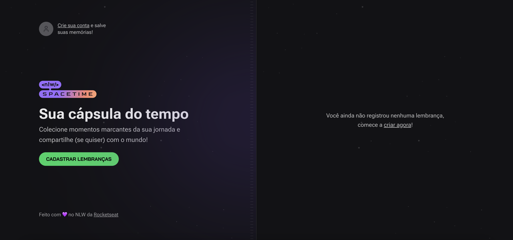

<h1 align="center">
    
</h1>

# NLW Spacetime Web

This is the web frontend of the NLW Spacetime project. Next Level Week (NLW) is an event organized by @Rocketseat for hands-on teaching on the most up-to-date technologies in the software development market in the javascript universe.
On this project we tested new features and concepts like Next App Router, Server Components, App Layout, Api Route, middleware, OAuth Authentication Protocol

## Content Table
<!--ts-->
   * [About](#about)
   * [Usage](#usage)
      * [Prerequisites](#prerequisites)
      * [Local files](#local-files)
      * [Commands](#commands)
   * [Features](#features)
   * [Technologies](#technologies)
<!--te-->

## Usage

To run the project you need to follow the steps below:

### Prerequisites
<ul style="list-style-type: none;" id="prerequisites">
  <li>Node v18 or higher</li>
  <li><a href="https://github.com/renanfneves/nlw-spacetime-server">The NLW Spacetime Server</a> running</li>
  <li>Github account for authentication</li>
  <li>Github OAuths Apps keys</li>
</ul>

### Local Files
<ul style="list-style-type: none;" id="local-files">
  <li>NEXT_PUBLIC_GITHUB_CLIENT_ID (id generated on Github OAuth Apps)</li>
</ul>

### Commands
<ul style="list-style-type: none;" id="local-files">
  <li>npm install</li>
  <li>npm run dev</li>
</ul>

## Features
<ul style="list-style-type: none;" id="features">
  <li>Github OAuth Authentication</li>
  

    
  

  <li>Memories registry</li>
  

    
  

  <li>Images uploads</li>
  <li>Memories list</li>
  

    

</ul>

## Technologies
<ul style="list-style-type: none;" id="features">
  <li>React 18</li>
  <li>Next.js 13</li>
  <li>Typescript</li>
  <li>TailwindCSS</li>
  <li>Github OAuth protocol</li>
</ul>

